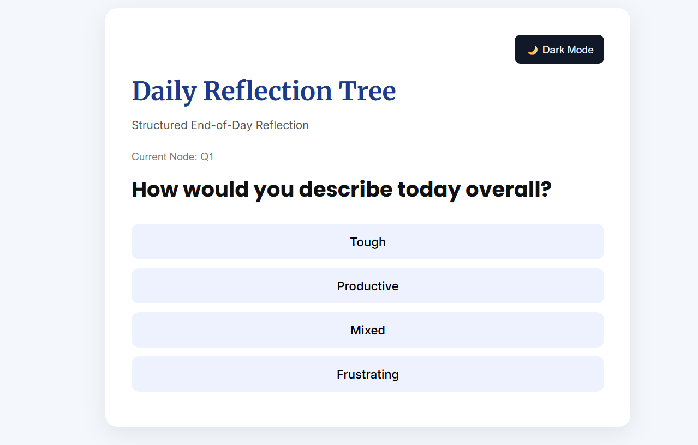
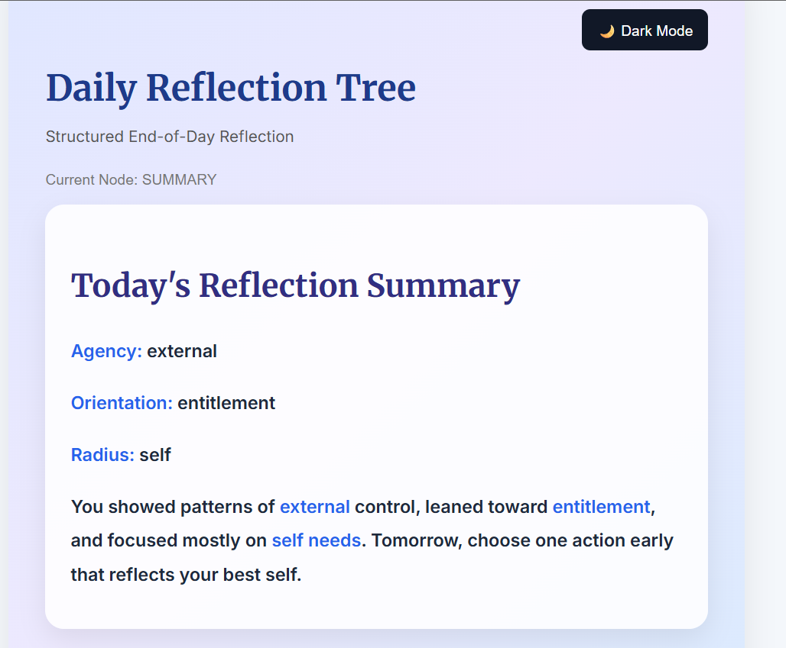
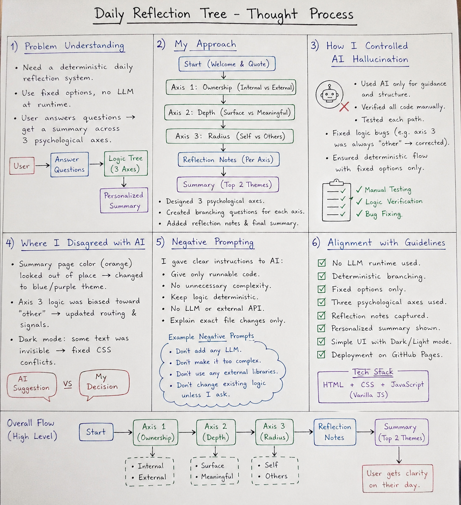

# Daily Reflection Tree

A deterministic reflection web application built using HTML, CSS, and JavaScript.

This project guides users through structured end-of-day reflection using a fixed decision tree across three psychological axes:

- Agency (Victim vs Victor)
- Contribution (Entitlement vs Contribution)
- Radius of Concern (Self vs Others)

---

## Live Demo

https://Khushipratibha.github.io/daily-reflection-tree/

---

## Features

- Deterministic branching logic
- No LLM / API usage at runtime
- Fixed options only
- Dynamic reflection summary
- Dark / Light mode
- Responsive UI

---

## Tech Stack

- HTML
- CSS
- JavaScript

---

## Project Screenshots

## Home Page

---

## Reflection Questions

---

## Summary Page

---

## Hand-Drawn Thought Process

---

## How It Works

Start → Axis 1 → Axis 2 → Axis 3 → Final Summary

---

## Files

- `index.html`
- `style.css`
- `script.js`

---

## Submission Notes

This project was created as part of the DeepThought Growth Teams role simulation assignment.